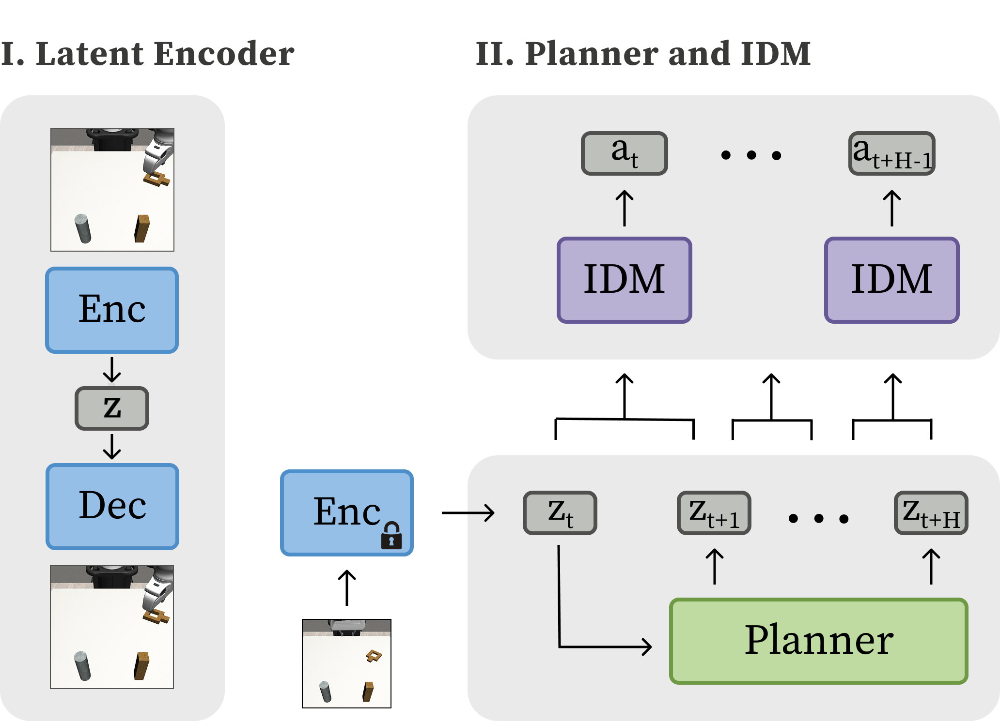

# Latent Diffusion Planning
Official implementation of [Latent Diffusion Planning](https://arxiv.org/abs/2504.16925).

\[[Paper](https://arxiv.org/abs/2504.16925)\] \[[Website](https://amberxie88.github.io/ldp/)\]

## Method


## Training Latent Encoder
To train the variational autoencoder:
```
python3 train_vae.py experiment_folder=VAE_FOLDER experiment_name=VAE_NAME data=cfg/rm_lift/mixed_img
``` 

## Training Latent Diffusion Planning Agent
First, process the image data into latent space. This avoids VAE inference during dataloading and thus accelerates training. 
```
python3 process_sdvae_data.py experiment_folder=FOLDER experiment_name=NAME data=cfg/rm_lift/img data.train_path=DATA_PATH restore_snapshot_path=PATH_TO_VAE_CKPT
```

Then, to train the LDP agent, run `train_bc.py`. To train the IDM with mixed batches (i.e. with expert demonstrations and suboptimal data), instead run `train_mixed_bc.py`. You will need to set the paths to the data and the generated latents from the script above. Additionally, ensure that the min/max bounds for the latent representations are accurate.
```
python3 train_bc.py experiment_folder=FOLDER experiment_name=NAME agent=ldp_agent data=cfg/rm_lift/latent_img  agent.vae_pretrain_path=PATH_TO_VAE_CHECKPOINT data.meta.obs_normalization.obs.latent_agentview_image.min=-10 data.meta.obs_normalization.obs.latent_agentview_image.max=10 horizon=9 action_horizon=4 -cn train_mixed_bc_rm_lift

python3 train_mixed_bc.py experiment_folder=FOLDER experiment_name=NAME agent=ldp_agent data=cfg/rm_lift/latent_img  agent.vae_pretrain_path=PATH_TO_VAE_CHECKPOINT data.meta.obs_normalization.obs.latent_agentview_image.min=-10 data.meta.obs_normalization.obs.latent_agentview_image.max=10 horizon=9 action_horizon=4 -cn train_mixed_bc_rm_lift
```

## Data Collection
To collect suboptimal data, first train a noisy imitation learning agent, and then collect rollouts. This simulates how we might collect real-world suboptimal data, e.g. failed rollouts from a policy we are evaluating.
```
python3 train_bc.py experiment_folder=FOLDER experiment_name=NAME data=cfg/rm_lift/img n_grad_steps=1000 save_every_step=1000 warmup_steps=10

python3 collect_data.py experiment_folder=FOLDER experiment_name=NAME folder_tag=1 eval_tag=test ckpt=1000 n_eval_episodes=500 save_path=PATH_TO_SAVE data.env_params.env_kwargs.lowdim_obs=[robot0_eef_pos,robot0_eef_quat,robot0_gripper_qpos,object]
```

## Installation
First, create your conda environment:

```
conda env create -f env.yml
pip install --upgrade "jax[cuda12_pip]==0.4.26" -f https://storage.googleapis.com/jax-releases/jax_cuda_releases.html
```

Download the [Robomimic Dataset](https://robomimic.github.io/docs/datasets/robomimic_v0.1.html) and re-render observations at 64x64. Make sure the robosuite version is consistent across dataset generation and policy evaluation. Generate [ALOHA Data](https://github.com/tonyzhaozh/act) via `MUJOGO_GL=egl python3 collect_aloha_scripted_demos.py --task_name sim_transfer_cube_scripted --dataset_path YOUR_PATH --num_episodes NUM_EPISODE`

## Citation
```
@misc{xie2025latentdiffusionplanningimitation,
      title={Latent Diffusion Planning for Imitation Learning}, 
      author={Amber Xie and Oleh Rybkin and Dorsa Sadigh and Chelsea Finn},
      year={2025},
      eprint={2504.16925},
      archivePrefix={arXiv},
      primaryClass={cs.RO},
      url={https://arxiv.org/abs/2504.16925}, 
}
```